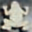
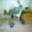
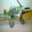
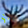
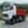
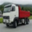

# Simple Autoencoder

## Description
The autoencoder first reduces images from Cifar-10 to a low dimensional vector of random variables using a conv net. 

More specifically, the autoencoder reduces the image into two vectors. One is treated as a vector of means for a normal distribution. The other is treated as a corresponding vector of standard deviations. These two vectors are used to construct a z vector whose entries are drawn from the normal distributions created by the corresponding mean and standard deviation vectors. 

The z vector is used to predict the class of the image and is then fed into a convolution transpose net to reconstruct the original image.

Losses from both the prediction error and the reconstruction error are used in backprop.

Ideally, the autoencoder can be trained to create a semantically rich z vector that can be used for activities like Reinforcement Learning or machine memory. These applications are not included in this project.

## Experimental Setup

#### Encoder Architecture

- 3x3 Convolution, 16 filters, stride 1, padding 1
- ReLU
- 2D Batch Normalization
- 3x3 Convolution, 32 filters, stride 2, padding 1
- ReLU
- 2D Batch Normalization
- 3x3 Convolution, 64 filters, stride 2, padding 1
- ReLU
- 2D Batch Normalization
- 3x3 Convolution, 64 filters, stride 2, padding 1
- ReLU
- 2D Batch Normalization
- 1024 -> 256 Fully Connected (means); 1024 -> 256 Fully Connected (stds)
- Draw from Normal Distribution, multiply by stds and add means

#### Classifier Architecture

- 256 -> 200 Fully Connected
- ReLU
- 1d Batch Normalization
- 200 -> 10 Fully Connected

#### Reconstruction Architecture

- 256 -> 1024 Fully Connected
- ReLU
- 1d Batch Normalization
- 5x5 Convolution Transpose, 64 filters, stride 1, padding 0
- ReLU
- 2D Batch Normalization
- 5x5 Convolution Transpose, 64 filters, stride 1, padding 0
- ReLU
- 2D Batch Normalization
- 4x4 Convolution Transpose, 32 filters, stride 2, padding 0
- ReLU
- 2D Batch Normalization
- 5x5 Convolution Transpose, 16 filters, stride 1, padding 0
- ReLU
- 2D Batch Normalization
- 3x3 Convolution Transpose, 3 filters, stride 1, padding 0

The images used for this autoencoder were the Cifar-10 training dataset. The images were not preprocessed in any way before being fed to the autoencoder. 45000 were used as a training set, 5000 were kept as a validation set.

## Results
The final training accuracy was XXXXXXXXX% whereas the validation accuracy was XXXXXXX%. Here are some examples of the reconstructed images.

----
Reconstruction:

Original:

----
Reconstruction:

Original:

----
Reconstruction:

Original:

----
Reconstruction:

Original:

----
